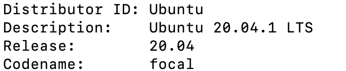
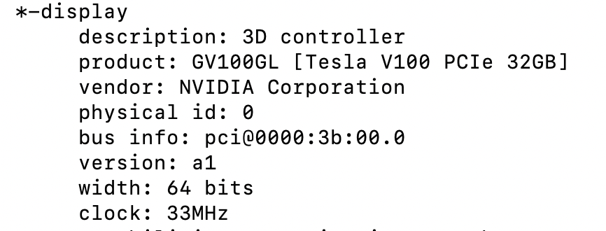

### Cuda配置
这篇文章将介绍cuda及CuDNN在server上的配置.

首先, 将系统版本展示如下lsb_release -a:
 
<!--  -->
以及gpu版本sudo lshw -C display: 
<!--  -->

然后需要在Nvidia https://developer.nvidia.com/cuda-downloads 官网下载相应版本的Cuda driver并根据官网教程安装, 通过nvidia-smi检查是否安装成功, 添加nvcc路径到~/.bashrc文件: 
- nvcc路径: where nvcc
- nano ~/.bashrc
- 添加如下两行到bashrc文件: 
  - export PATH=/usr/local/cuda-11.2/bin:$PATH
  - export LD_LIBRARY_PATH=/usr/local/cuda-11.2/lib64:$LD_LIBRARY_PATH
  - source ~/. bashrc
  - 检查路径是否添加成功: nvcc -V
### 安装CuDNN
同样的, 需要从官网下载CuDNN安装包 https://developer.nvidia.com/cudnn-download-survey, 根据官网步骤安装. 
### 安装tensorflow
pip3 install tensorflow
### 检查gpu是否avaiable
通过如下代码:
import tensorflow as tf 
tf.test.is_gpu_available(
    cuda_only=False, min_cuda_compute_capability=None
) 
