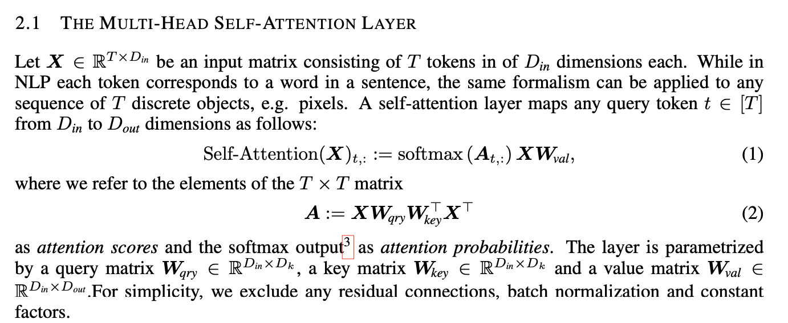
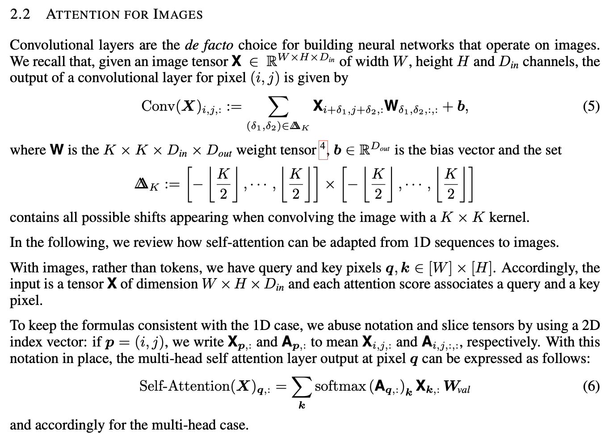

## 一个简单的小例子: attention for text
假设我们要对一个长度为10个词的sentence: X(10*100)进行attention, 每个词维度为100. 首先会计算10*10的attention score:  
query matrix: 100*K, key matrix: 100*K  
X * query matrix * transpose(key matrix) * transpose(X) 
Attension probablity is computed afterwards as a softmax  of attention score times value:  
attention probalility(X)_t = softmax(i_th, attention score,:)*X*value,  where value is [100, d_out]

## Attention for images

Reference paper: 
<a href ="https://openreview.net/pdf?id=HJlnC1rKPB"> ON THE RELATIONSHIP BETWEEN SELF-ATTENTION AND CONVOLUTIONAL LAYERS </a>